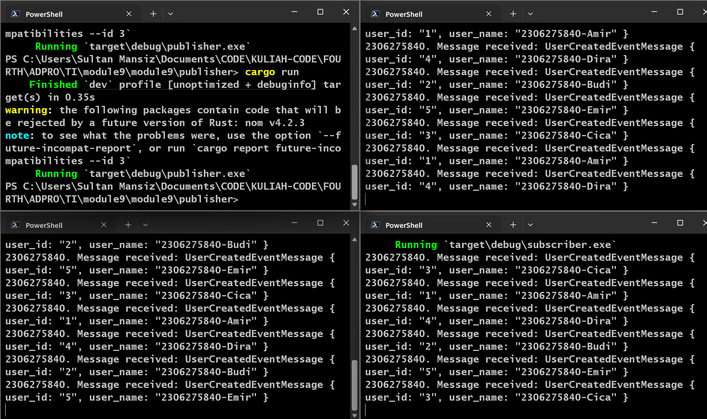
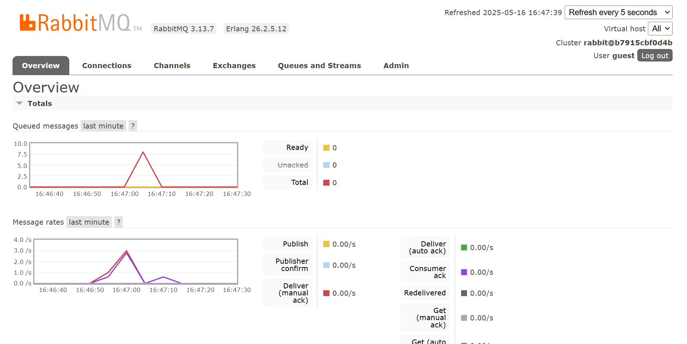

| NAME               | ID         | ADVPROG CLASS |
| ------------------ | ---------- | ------------- |
| Sultan Ibnu Mansiz | 2306275840 | B             |

# Module 9: Software Architecture - Reflection

## 1. What is ***amqp***?
AMQP, or Advanced Message Queuing Protocol, is a messaging standard designed for asynchronous communication between applications. It facilitates dependable message transmission, efficient routing, and service decoupling, making it well-suited for distributed systems.

## 2. What does it mean *guest:guest@localhost:5672*, what is the first `guest`, and what is the second `guest`, and what is `localhost:5672` is for?
The initial `guest` refers to the username required for authentication with the RabbitMQ server, while the second `guest` represents the corresponding password. The notation `localhost:5672` specifies the local machine's address (`localhost`) and the designated port (`5672`) for connecting to the RabbitMQ server.

---

### Slow Subscriber Simulation

The chart shows a spike in published messages (yellow) followed by successful delivery and acknowledgment. At this moment, the message queue is empty, with no messages in 'Ready' or 'Unacked' state. This indicates that the subscriber successfully consumed all published messages without backlog.

### Three Subscribers Simulation

Based on the execution logs and the RabbitMQ dashboard, it is evident that two subscriber instances were successfully running and each received a different subset of messages from the publisher. The message rates chart shows a spike in yellow (publish) followed closely by a spike in purple (consumer acknowledgment), indicating that messages were consumed and acknowledged in near real-time. Additionally, the "Queued messages" section shows zero messages in both the "Ready" and "Unacked" states, confirming that there was no backlog and all messages were processed immediately. The terminal logs support this by showing that the subscribers received different messages, demonstrating effective load balancing between them.
